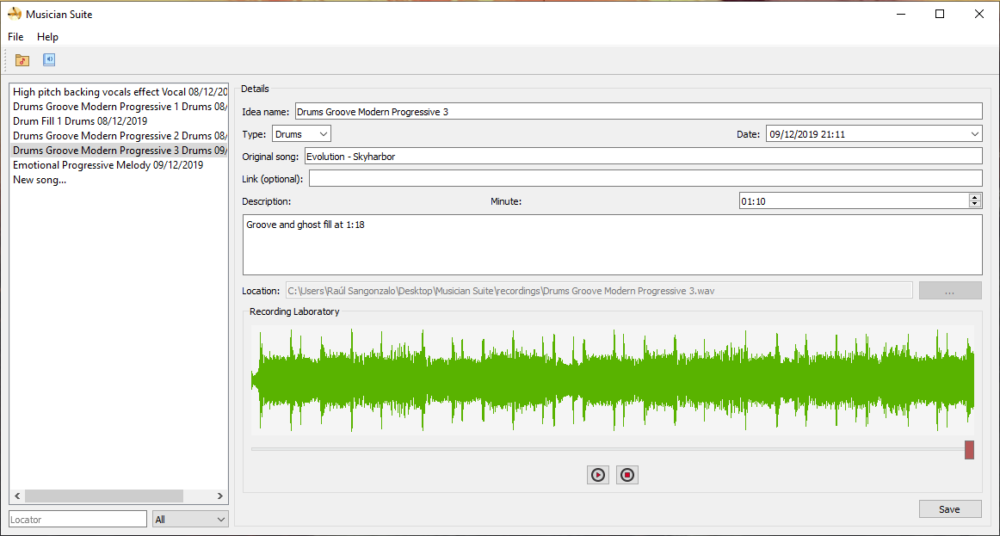

# MusicianSuite
>A suite of functions for the average musician. Current version 0.1 beta. Tested in Windows 10 64 and Mac OS X Sierra 10.12 64. 

## Executables

Windows 10 64 bit
https://drive.google.com/open?id=1oEYiETYSMmxNeYxUoc9-H3NtxtLlRcQV

Mac OS (Compiled in 10.12 Sierra)
https://drive.google.com/open?id=1u4sMoifdaz2PNbwI4TcXsK-IB0kt0-av
>You need to install Soundflower to make use of the recording function!

Recording function is set up with 44.1kHz sample rate (you might have to change your settings if your default device runs in a different sample rate).
## Python 3 dependencies needed:
In case you want to execute it through Python:
- PyQt5
- soundcard
- numpy
- wavio
- pydub
- sqlite3
- Pillow

To use:
```
python musiciansuite.py
```

## Disclaimer
This project started as an idea because I felt the need to organize my own music and I couldn't find any existing app for this purpose. Having said that, I am a self-taught programmer with less than two years of experience, which means some codes need refactoring and use of conventions. That hasn't stopped me, however, to write this simple but effective app. It will become more stable with time if you are patient. Any errors, don't hesitate to open a discussion or to contact me at raulsangonzalo@gmail.com. I hope you enjoy it!

## Screenshots:
<p align="center"></p>


